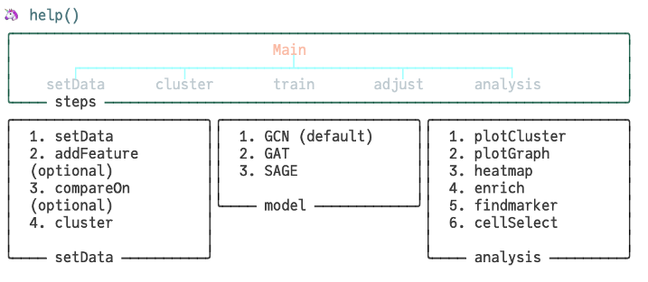

## MSGNN multi source integration with Graph neural network

### Installation 
min requirements 

1. Julia 1.8+

recommend enviroment： 

1. to use leiden function for cluster， a python enviroment with leiden installed is required
2. for enrichment plot， a R enviroment with clusterProfilers installed is required
3. to run Seurat in Julia

installation from github 
```julia
pkg.dev(https://github.com/YuLab-SMU/MSGNN) 
```
for R user，  [JuliaCall](https://cran.r-project.org/web/packages/JuliaCall/readme/README.html) provides seamless Integration of R and Julia.

or you can run R script in julia session after press `$`.


### usage
1. import the package
```julia
using MSGNN 
```

2. get help dashboard
```julia
help()
```
out:
 
PS. in case in modern terminal support UTF-8, dashboard will display the emojis

3. set the molecular data
```julia
# RNA is a count matrix with cell in column gene in row.
# geneName is the name of gene correspond to RNA counts
d = setData(RNA,rawfeature = geneName) 
```

4. add other data
```julia
# data2 is a matrix with cell in column, feature info in row.
# featureName is the name of features info
addFeature!(d, data2, featureName)
```

5. cluster
```julia 
cluster!(d,tresolution = 0.1) 
```


6. data visulization and downstream analysis
```julia
# plot cluster result
plotCluster(d, label = label, filename = "clusterResult")
heatmap(d.X)
```


7. train and adjust 
```julia
train(d,Enclayers=[10,10],
             debug=false,
             label=label,
             epochs=50,early_stop = 10)
adjust!(d)
```

8. visulization of the final result
```julia
# PCA
pc = MSGNN.PCA(d.metaInfo.adjust_emb,
	outdim=2)
plotScatter(pc,	label=label)
```
